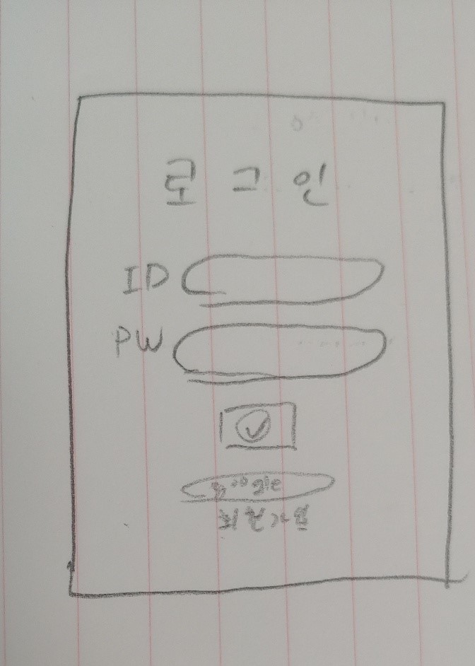

# 프로젝트 주제

소심하고 외모에 자신없는 사람들(ex. 김학준 - 부끄러움이 굉장히 많음 )이 편하게 사람들을 만나고 대화할수 있는 서비스

### 팀명

오작교(까막까치)

소심한 사나이(소심한 형제들)

외로운(쓸쓸한) 가을

### 프로젝트명

사람과 사람 잇다

너의 목소리가 보여

아만다(아무나 만나지 않는다)와 좀 반대되는 이름이 뭐가 있을까?

# 와이어프레임

1. #### 첫페이지

   

   * 소셜로그인

2. #### 회원가입, 로그인

   

   * #### 1인 1계정을 위한 휴대폰인증 or 이메일인증

   

3. #### 첫 로그인 페이지

   

   * 성격부분 mbti로 하면 좋을것같다.

4. #### 메인페이지

   

5. #### 메인페이지(filter)

   

   * 자신이 대화하고 싶은 사람의 조건 선택 가능(조건 랜덤선택 가능)

     * 다른 서비스는 모르겠으나 아자르같은 경우는 성별,국가 선택기능밖에 없었음

   * 조건선택으로 필터링된 사람들중에서 랜덤으로 매칭

     

6. #### 매칭 후 블라인드 미팅

   

   * 상대방의 표정 및 음성 분석을 통해 상대방의 감정, 호감도에 따른 이모티콘 변화 및 호감도 수치, 감정상태 표시
   * 얼굴 공개 기능 없애고 블라인드기능 강화( 타 어플과의 차별화 )
     * 연애에 국한된 서비스가 아닌 동성or이성친구, 대화상대, 취미를 공유하고픈 사람들을위한 서비스였으면 좋겠다.(사람과 사람을 잇다)
     * 얼굴 공개 기능이 생길경우 상대방의 얼굴 공개를 계속해서 요구하는 상황 발생할수도 있다고 생각한다.
       * 상대방 둘다 원하면 얼굴 공개 가능하게 하는 기능에 대해서는 생각을 좀 해봐야 할것같다.
       * 얼굴 공개 기능이 포함되게 되면 다른 어플들과 차별성이 떨어진다고 생각이됨..
       * 친구 등록 후 채팅방에서 페이스톡 하는 기능??
     * 소심한(부끄러움이 많은) 사람들, 외모에 자신없는 사람들에게 블라인드만의 강점이 있다고 생각한다.
   * 차단기능 추가
     * 조건내에서 랜덤매칭이기 때문에 다음부턴 매칭안됨

7. ### 친구 등록 후 친구목록

   

   * 친구등록한 사람과의 메신저 기능

     * 보이스톡, 페이스톡 기능?
     * 

     ​	