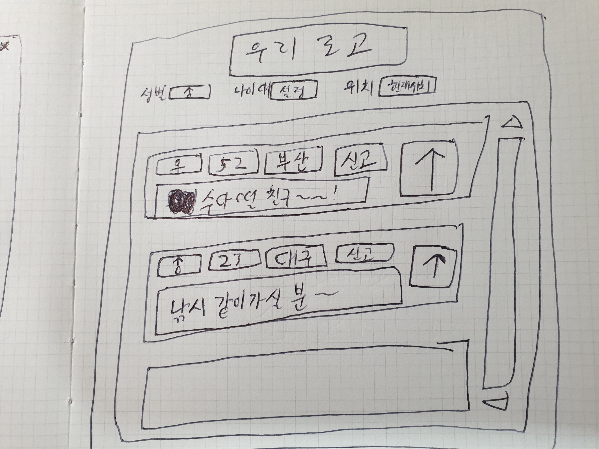
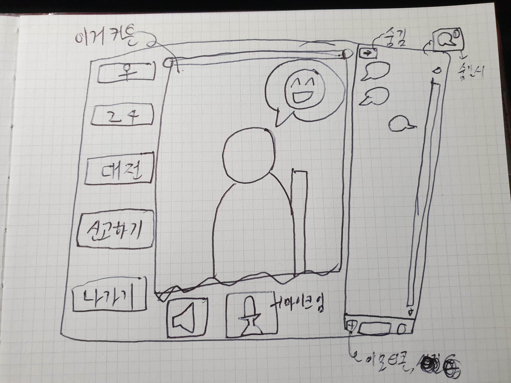

# AI프젝 와이어프레임

### 1. 팀명

- 한명빼고 여친없음

- 우리가 쓸거임

### 2. 프로젝트명

- 눈먼 만남

- 마음지상주의

### 3. 페르소나

- 외모에 관계 없이 자신과 마음이 맞는 친구, 짝을 찾고 싶은 20대 남성 A씨
- 자신의 외모에 자신이 없음

- 이성을 대하기 어려워 함
- 기존의 만남 어플들은 모두 외모의 비중이 크기에 사용하기 꺼려함

### 4. A 씨의 고민을 해결해줄 프로그램 

- 회원가입 시 성별, 나이, 폰번만 기입하며 GPS를 통해 현재 자신의 위치가 파악됨(동의 하에)
- 메인 페이지에는 다른 사람과의 만남을 위한 방 리스트가 있으며 위치별 / 나이대별 / 성별 3 가지를 통해 출력되는 방 리스트 필터링 가능
- 방에는 최대 2명만 입장할 수 있으며, 상대방과 음성 또는 채팅으로 대화할 수 있음
- 모든 것은 블라인드로 이루어지며, 상대에 대해 알 수 있는 것은 성별, 나이, 대략적 위치 3가지 뿐

- AI

  - 상대방의 나에 대한 호감도 실시간으로 분석

    - 음성
    - 제스쳐
    - 표정

    

### 5. 메인

### 6. 방 내부

### 나의 추가적 의견

- 여기서는 내면의 자신만으로 다른 사람들을 만나는 장소인 만큼, 유저가 자신이 타인에게 보여지는 모습을 꾸미는 그러한 기능은 배제했으면 함 ex) 아바타
- 만남어플 사용하는 사람들은 자신이 아는 사람이 만남 어플을 사용하는 자신을 발견하는 것을 매우 걱정한다고 함. 그러므로 이름 역시 유저정보에서 제외시켜서 신상을 보호해주는 것이 좋다고 생각